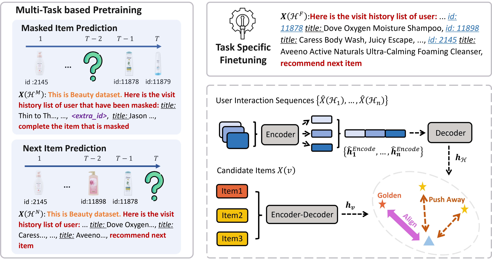

# Adapting Language Models to Text Matching based Recommendation Systems

This repository contains the source code for the paper: Adapting Language Models to Text Matching based Recommendation Systems.

[](https://huggingface.co/xhd0728/TASTE-plus-beauty)[](https://huggingface.co/xhd0728/TASTE-plus-sports)[](https://huggingface.co/xhd0728/TASTE-plus-toys)[](https://huggingface.co/xhd0728/TASTE-plus-yelp)[](https://huggingface.co/xhd0728/TASTE-plus-pretrain)

## Overview

TASTE$^+$ enhances sequential recommendation by adapting language models to text matching. It introduces two pretraining tasks, Masked Item Prediction and Next Item Prediction, which allow the model to capture richer matching signals from user–item sequences. By balancing attention between prompt tokens and item IDs, TASTE$^+$ builds more accurate user representations and improves recommendation performance on Yelp and Amazon datasets, demonstrating the effectiveness of language model pretraining for text matching-based recommendation.



## Requirements

### 1. Conda Environment

```bash
conda create -n taste-plus python=3.8
conda activate taste-plus
pip install -r requirements.txt
```

### 2. Install Openmatch

```bash
git clone https://github.com/OpenMatch/OpenMatch.git
cd OpenMatch
pip install -e .
```

## Reproduction Guide

This section provides a step-by-step guide to reproduce the TASTE$^+$ results.

### 1. Dataset Preprocessing

We utilize the Amazon Product 2014 and Yelp 2020 datasets. Download the original data from:

- [Amazon Product 2014](https://jmcauley.ucsd.edu/data/amazon/index_2014.html)
- [Yelp 2020](https://business.yelp.com/data/resources/open-dataset/)

The following example uses the Amazon Beauty dataset.

#### 1.1. Download and Prepare Amazon Beauty Dataset:

```bash
wget -c http://snap.stanford.edu/data/amazon/productGraph/categoryFiles/ratings_Beauty.csv
wget -c http://snap.stanford.edu/data/amazon/productGraph/categoryFiles/meta_Beauty.json.gz
```

#### 1.2. Unzip the Metadata File:

```bash
gzip -d meta_Beauty.json.gz
```

#### 1.3. Organize Files:

```bash
mkdir data
mv ratings_Beauty.csv data/
mv meta_Beauty.json data/
```

#### 1.4. Process Raw Data for Recbole:

```bash
mkdir dataset
bash scripts/process_origin.sh
```

#### 1.5. Extract and Process Required Data:

```bash
bash scripts/process_beauty.sh
```

### 2. Data Preprocessing

Before proceeding, process all four original datasets as described above to obtain the atomic files. Then, construct the mixed pretraining data for TASTE$^+$ according to your desired proportions.

#### 2.1. Construct Training and Test Data using Recbole:

```bash
bash scripts/gen_dataset.sh
```

#### 2.2. Generate Item Representations:

```bash
bash scripts/gen_pretrain_items.sh
```

#### 2.3. Sample Pretraining Data for TASTE$^+$:

For TASTE$^+$ pretraining data construction, we sampled the four datasets with balance. For each dataset, we selected the number of items corresponding to the dataset with the largest number of training samples and then randomly supplemented the datasets with insufficient training data:

```bash
python src/sample_train.py
```

Similarly, we selected the number of training samples from the dataset with the fewest training items in each case to serve as the validation set:

```bash
python src/sample_valid.py
```

#### 2.4. Construct Pretraining Data for Sampled Items:

```bash
bash scripts/build_pretrain.sh
```

#### 2.5. Merge Training and Validation Data:

```bash
python src/merge_json.py
```

### 3. Pretraining for TASTE$^+$

Pretrain the T5 model using next item prediction (NIP) and masked item prediction (MIP) tasks.

```bash
bash scripts/pretrain.sh
```

Adjust training parameters based on your GPU device. Select the checkpoint with the lowest evaluation loss as the final pretrained checkpoint.

### 4. Finetuning for TASTE$^+$

```bash
bash scripts/gen_train_items.sh
bash scripts/build_train.sh
```

#### 4.1. Train

```bash
bash scripts/train_ft.sh
```

#### 4.2. Evaluate

```bash
bash scripts/eval_ft.sh
```

#### 4.3. Test

```bash
bash scripts/test_ft.sh
```

## Contact

For questions, suggestions, or bug reports, please contact:

```
xinhaidong@stumail.neu.edu.cn
```